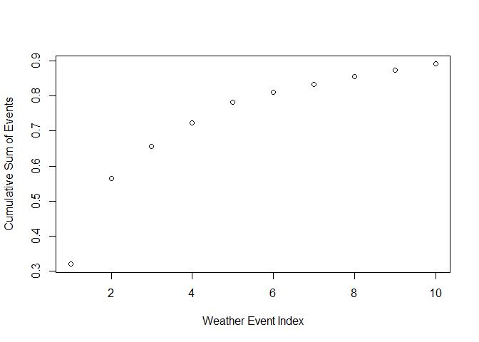

# Impact of Weather Events on Public Health and Economy

## Abstract

In this document, the impact of weather events on public health and economy across
the United State is evaluated.
The analysis is done based on the NOAA Storm Database.
First an exploratory analysis of the data is done,
to understand how to reduce the amount of available data
without compromising the expressiveness with respect to the addressed objectives.
From that, a data processing strategy is derived.
Eventually the impact of weather events on public health and economy are examined,
showing that tornados have the greatest impact on public health,
and floods on economy.

## Prerequisites


```r
library(dplyr)
```

```
## 
## Attache Paket: 'dplyr'
```

```
## Die folgenden Objekte sind maskiert von 'package:stats':
## 
##     filter, lag
```

```
## Die folgenden Objekte sind maskiert von 'package:base':
## 
##     intersect, setdiff, setequal, union
```

```r
library(stringr)
```

## Raw Data

The raw dataset is downloaded from the URL provided with the Course Assignment: [StormData.csv.bz2](https://d396qusza40orc.cloudfront.net/repdata%2Fdata%2FStormData.csv.bz2)
Most of the columns of the datasets can be discared as they are not relevant for
understanding the relationship between weather events and poulation health and economy across USA.
Data with an unknown weather event have been removed.


```r
if (!dir.exists("tmp")) {
  dir.create("tmp")
}
raw_data_file_path <- file.path("tmp", "StormData.csv.bz2")
if (!file.exists(raw_data_file_path)) {
  download.file("https://d396qusza40orc.cloudfront.net/repdata%2Fdata%2FStormData.csv.bz2",
    raw_data_file_path
  )
}
```


```r
raw_data <- as_tibble(read.csv(raw_data_file_path))
```

## Exploratory Analysis

### Data columns

The dataset contains a lot of columns, but only some of them seem to be relevant
for the present discussion.


```r
names(raw_data)
```

```
##  [1] "STATE__"    "BGN_DATE"   "BGN_TIME"   "TIME_ZONE"  "COUNTY"    
##  [6] "COUNTYNAME" "STATE"      "EVTYPE"     "BGN_RANGE"  "BGN_AZI"   
## [11] "BGN_LOCATI" "END_DATE"   "END_TIME"   "COUNTY_END" "COUNTYENDN"
## [16] "END_RANGE"  "END_AZI"    "END_LOCATI" "LENGTH"     "WIDTH"     
## [21] "F"          "MAG"        "FATALITIES" "INJURIES"   "PROPDMG"   
## [26] "PROPDMGEXP" "CROPDMG"    "CROPDMGEXP" "WFO"        "STATEOFFIC"
## [31] "ZONENAMES"  "LATITUDE"   "LONGITUDE"  "LATITUDE_E" "LONGITUDE_"
## [36] "REMARKS"    "REFNUM"
```
Only the following variables seem to be relevant:

- `EVTYPE`: the type of weather event
- `FATALITIES`: The number of deaths caused by a weather event
- `INJURIES`: The number of injuries caused by a weather event
- `PROPDMG`: The estimated amount of damage to property incurred by the weather event
- `PROPDMGEXP`: The unit of the property damage measurement
- `CROPDMG`: The estimated amount of damage to crops incurred by the weather event
- `CROPDMGEXP`: The unit of the crop damage measurement

### Weather Event Types

There is a large number of different values in the `EVTYPE` column.
The values do not seem to be normalized:

 - some values seem to be invalid or not useful (e.g. `?`, `Summary August 10`),
 - some values are representing the same weather event (e.g. `TSTM WIND` and `THUNDERSTORM WINDS`).

> For details see `Appendix - List of Event Types`.

To avoid a normalization of the entire set of given event types, it makes sense to
take a look at the overall distribution of event types,
to find out if it is safe to focus on just a smaller subset of the events.


```r
N <- dim(raw_data)[1]
by_evt_count <- raw_data %>%
  group_by(EVTYPE) %>%
  summarise(n = n()) %>%
  arrange(desc(n))
with(by_evt_count,
  plot(cumsum(n[1:10] / N), ylab = "Cumulative Sum of Events", xlab = "Weather Event Index")
)
```

<!-- -->

**Distribution of Event Types**: The top ten events with highest frequency
  cover nearly 90% of the overall cases.

The top-ten event types contain some redundant values, i.e. different values
for the same weather event: `TSTM WIND`, `THUNDERSTORM WIND`, and `THUNDERSTORM WINDS`.
Thus, a normalization joining these values makes sense.


```r
by_evt_count[1:10, 'EVTYPE']
```

```
## # A tibble: 10 x 1
##    EVTYPE            
##    <chr>             
##  1 HAIL              
##  2 TSTM WIND         
##  3 THUNDERSTORM WIND 
##  4 TORNADO           
##  5 FLASH FLOOD       
##  6 FLOOD             
##  7 THUNDERSTORM WINDS
##  8 HIGH WIND         
##  9 LIGHTNING         
## 10 HEAVY SNOW
```

### Fatalities and Injuries

The given data for fatalities and injuries does not indicate any need for preprocessing.


```r
summary(raw_data[, c('FATALITIES', 'INJURIES')])
```

```
##    FATALITIES          INJURIES        
##  Min.   :  0.0000   Min.   :   0.0000  
##  1st Qu.:  0.0000   1st Qu.:   0.0000  
##  Median :  0.0000   Median :   0.0000  
##  Mean   :  0.0168   Mean   :   0.1557  
##  3rd Qu.:  0.0000   3rd Qu.:   0.0000  
##  Max.   :583.0000   Max.   :1700.0000
```

### Property Damage

Property damage is expressed via two different columns: `PROPDMG` and `PROPDMGEXP`

- `PROPDMG` provides a numeric value
- `PROPDMGEXP` defines how the value of `PROPDMG` has to be multiplied

For `PROPDMGEXP` the following values can be found:


```r
unique(raw_data$PROPDMGEXP)
```

```
##  [1] "K" "M" ""  "B" "m" "+" "0" "5" "6" "?" "4" "2" "3" "h" "7" "H" "-" "1" "8"
```

The provided documentation does not explain how all of these values should
be interpreted.
The frequency of values indicates that it is safe to focus
only on the following values (assuming the common interpretation)

- `B` (billion),
- `M` (million),
- `K` (thousand),
- `H` (hundred)


```r
table(raw_data$PROPDMGEXP)
```

```
## 
##             -      ?      +      0      1      2      3      4      5      6 
## 465934      1      8      5    216     25     13      4      4     28      4 
##      7      8      B      h      H      K      m      M 
##      5      1     40      1      6 424665      7  11330
```
> Note: there are samples in lower and upper case.

### Crop Damage

Crop damage is expressed via two different columns: `CROPDMG` and `CROPDMGEXP`

- `CROPDMG` provides a numeric value
- `CROPDMGEXP` defines how the value of `CROPDMG` has to be multiplied

For `CROPDMGEXP` the following values can be found:


```r
unique(raw_data$CROPDMGEXP)
```

```
## [1] ""  "M" "K" "m" "B" "?" "0" "k" "2"
```

Similar to `PROPDMGEXP` there are values which are difficult to interpret.


```r
table(raw_data$CROPDMGEXP)
```

```
## 
##             ?      0      2      B      k      K      m      M 
## 618413      7     19      1      9     21 281832      1   1994
```

The table of frequencies indicates that it is admissible to focus on these values:

- `B` (billion),
- `M` (million),
- `K` (thousand),
- `H` (hundred)

> Note: similar to `PROPDMGEXP` there are values in lower and upper case

## Data Preprocessing

From the Exploratory Data Analysis the following actions are indicated:

- Selecting relevant columns
- Removing rows without EVTYPE
- Joining EVTYPE variants for "THUNDERSTORM WIND"
- Subsetting to the Top-Ten Events


```r
data <- raw_data %>%
  select(EVTYPE, FATALITIES, INJURIES, PROPDMG, PROPDMGEXP, CROPDMG, CROPDMGEXP) %>%
  filter(EVTYPE != "?") %>%
  mutate(EVTYPE = case_when(
    EVTYPE %in% c("TSTM WIND", "THUNDERSTORM WIND", "THUNDERSTORM WINDS") ~ "THUNDERSTORM WIND",
    TRUE ~ EVTYPE)
  )
data_by_event_count <- data %>% group_by(EVTYPE) %>% summarise(n = n()) %>% arrange(desc(n))
top_ten_events <- data_by_event_count[1:10,]$EVTYPE
top_ten_events_data = data %>% filter(EVTYPE %in% top_ten_events)
```

## Impact on Public Health

The top three weather events with respect to injuries and fatalities are
tornados, floods, and thunderstorm winds.
With respect to only fatalities they are tornados, flash floods, and lightings.


```r
  top_ten_events_data %>%
  group_by(EVTYPE) %>%
  summarise(total_injuries = sum(INJURIES),
            total_fatalities = sum(FATALITIES),
            total_casualities = sum(INJURIES + FATALITIES)) %>%
  arrange(desc(total_casualities))
```

```
## # A tibble: 10 x 4
##    EVTYPE            total_injuries total_fatalities total_casualities
##    <chr>                      <dbl>            <dbl>             <dbl>
##  1 TORNADO                    91346             5633             96979
##  2 THUNDERSTORM WIND           9353              701             10054
##  3 FLOOD                       6789              470              7259
##  4 LIGHTNING                   5230              816              6046
##  5 FLASH FLOOD                 1777              978              2755
##  6 WINTER STORM                1321              206              1527
##  7 HIGH WIND                   1137              248              1385
##  8 HAIL                        1361               15              1376
##  9 HEAVY SNOW                  1021              127              1148
## 10 HEAVY RAIN                   251               98               349
```
**Impact on Public Health**: tornados are the source for most injuries as well as fatalities.

## Impact on Economy

The top three weather events with respect to economic consequences are floods, tornados, and hails.
With respect to just property damage they are floods, tornados, and flash floods.
With respect to just crop damage they are floods, hail, and flash floods.


```r
  top_ten_events_data %>%
  mutate(
    property_damage = case_when(
      str_detect(PROPDMGEXP, regex('B', ignore_case = TRUE)) ~ 1000000000 * PROPDMG,
      str_detect(PROPDMGEXP, regex('M', ignore_case = TRUE)) ~ 1000000 * PROPDMG,
      str_detect(PROPDMGEXP, regex('K', ignore_case = TRUE)) ~ 1000 * PROPDMG,
      str_detect(PROPDMGEXP, regex('H', ignore_case = TRUE)) ~ 100 * PROPDMG,
      TRUE ~ 0
    ),
    crop_damage = case_when(
      str_detect(CROPDMGEXP, regex('B', ignore_case = TRUE)) ~ 1000000000 * CROPDMG,
      str_detect(CROPDMGEXP, regex('M', ignore_case = TRUE)) ~ 1000000 * CROPDMG,
      str_detect(CROPDMGEXP, regex('K', ignore_case = TRUE)) ~ 1000 * CROPDMG,
      str_detect(CROPDMGEXP, regex('H', ignore_case = TRUE)) ~ 100 * CROPDMG,
      TRUE ~ 0
    )
  ) %>%
  group_by(EVTYPE) %>%
  summarise(
    total_property_damage = sum(property_damage),
    total_crop_damage = sum(crop_damage),
    total_damage = sum(property_damage + crop_damage)
  ) %>%
  arrange(desc(total_damage)) %>%
  mutate(
    total_property_damage = paste(round(total_property_damage / 1000000000, digits = 2) , ' B'),
    total_crop_damage = paste(round(total_crop_damage / 1000000000, digits = 2) , ' B'),
    total_damage = paste(round(total_damage / 1000000000, digits = 2) , ' B'),
  )
```

```
## # A tibble: 10 x 4
##    EVTYPE            total_property_damage total_crop_damage total_damage
##    <chr>             <chr>                 <chr>             <chr>       
##  1 FLOOD             144.66  B             5.66  B           150.32  B   
##  2 TORNADO           56.94  B              0.41  B           57.35  B    
##  3 HAIL              15.73  B              3.03  B           18.76  B    
##  4 FLASH FLOOD       16.14  B              1.42  B           17.56  B    
##  5 THUNDERSTORM WIND 9.7  B                1.16  B           10.86  B    
##  6 WINTER STORM      6.69  B               0.03  B           6.72  B     
##  7 HIGH WIND         5.27  B               0.64  B           5.91  B     
##  8 HEAVY RAIN        0.69  B               0.73  B           1.43  B     
##  9 HEAVY SNOW        0.93  B               0.13  B           1.07  B     
## 10 LIGHTNING         0.93  B               0.01  B           0.94  B
```
**Economic Consequences**: floods are the source for most property and crop damages.

## Result

The impact of weather events on public health and economy across the United States have
been investigated. The analysis reveals that tornados have the greatest impact on public health,
while floods have the greatest impact on economy.

# Appendix

## List of Event Types


```r
sort(unique(raw_data$EVTYPE))
```

```
##   [1] "   HIGH SURF ADVISORY"          " COASTAL FLOOD"                
##   [3] " FLASH FLOOD"                   " LIGHTNING"                    
##   [5] " TSTM WIND"                     " TSTM WIND (G45)"              
##   [7] " WATERSPOUT"                    " WIND"                         
##   [9] "?"                              "ABNORMAL WARMTH"               
##  [11] "ABNORMALLY DRY"                 "ABNORMALLY WET"                
##  [13] "ACCUMULATED SNOWFALL"           "AGRICULTURAL FREEZE"           
##  [15] "APACHE COUNTY"                  "ASTRONOMICAL HIGH TIDE"        
##  [17] "ASTRONOMICAL LOW TIDE"          "AVALANCE"                      
##  [19] "AVALANCHE"                      "BEACH EROSIN"                  
##  [21] "Beach Erosion"                  "BEACH EROSION"                 
##  [23] "BEACH EROSION/COASTAL FLOOD"    "BEACH FLOOD"                   
##  [25] "BELOW NORMAL PRECIPITATION"     "BITTER WIND CHILL"             
##  [27] "BITTER WIND CHILL TEMPERATURES" "Black Ice"                     
##  [29] "BLACK ICE"                      "BLIZZARD"                      
##  [31] "BLIZZARD AND EXTREME WIND CHIL" "BLIZZARD AND HEAVY SNOW"       
##  [33] "Blizzard Summary"               "BLIZZARD WEATHER"              
##  [35] "BLIZZARD/FREEZING RAIN"         "BLIZZARD/HEAVY SNOW"           
##  [37] "BLIZZARD/HIGH WIND"             "BLIZZARD/WINTER STORM"         
##  [39] "BLOW-OUT TIDE"                  "BLOW-OUT TIDES"                
##  [41] "BLOWING DUST"                   "blowing snow"                  
##  [43] "Blowing Snow"                   "BLOWING SNOW"                  
##  [45] "BLOWING SNOW- EXTREME WIND CHI" "BLOWING SNOW & EXTREME WIND CH"
##  [47] "BLOWING SNOW/EXTREME WIND CHIL" "BREAKUP FLOODING"              
##  [49] "BRUSH FIRE"                     "BRUSH FIRES"                   
##  [51] "COASTAL  FLOODING/EROSION"      "COASTAL EROSION"               
##  [53] "Coastal Flood"                  "COASTAL FLOOD"                 
##  [55] "coastal flooding"               "Coastal Flooding"              
##  [57] "COASTAL FLOODING"               "COASTAL FLOODING/EROSION"      
##  [59] "Coastal Storm"                  "COASTAL STORM"                 
##  [61] "COASTAL SURGE"                  "COASTAL/TIDAL FLOOD"           
##  [63] "COASTALFLOOD"                   "COASTALSTORM"                  
##  [65] "Cold"                           "COLD"                          
##  [67] "COLD AIR FUNNEL"                "COLD AIR FUNNELS"              
##  [69] "COLD AIR TORNADO"               "Cold and Frost"                
##  [71] "COLD AND FROST"                 "COLD AND SNOW"                 
##  [73] "COLD AND WET CONDITIONS"        "Cold Temperature"              
##  [75] "COLD TEMPERATURES"              "COLD WAVE"                     
##  [77] "COLD WEATHER"                   "COLD WIND CHILL TEMPERATURES"  
##  [79] "COLD/WIND CHILL"                "COLD/WINDS"                    
##  [81] "COOL AND WET"                   "COOL SPELL"                    
##  [83] "CSTL FLOODING/EROSION"          "DAM BREAK"                     
##  [85] "DAM FAILURE"                    "Damaging Freeze"               
##  [87] "DAMAGING FREEZE"                "DEEP HAIL"                     
##  [89] "DENSE FOG"                      "DENSE SMOKE"                   
##  [91] "DOWNBURST"                      "DOWNBURST WINDS"               
##  [93] "DRIEST MONTH"                   "Drifting Snow"                 
##  [95] "DROUGHT"                        "DROUGHT/EXCESSIVE HEAT"        
##  [97] "DROWNING"                       "DRY"                           
##  [99] "DRY CONDITIONS"                 "DRY HOT WEATHER"               
## [101] "DRY MICROBURST"                 "DRY MICROBURST 50"             
## [103] "DRY MICROBURST 53"              "DRY MICROBURST 58"             
## [105] "DRY MICROBURST 61"              "DRY MICROBURST 84"             
## [107] "DRY MICROBURST WINDS"           "DRY MIRCOBURST WINDS"          
## [109] "DRY PATTERN"                    "DRY SPELL"                     
## [111] "DRY WEATHER"                    "DRYNESS"                       
## [113] "DUST DEVEL"                     "Dust Devil"                    
## [115] "DUST DEVIL"                     "DUST DEVIL WATERSPOUT"         
## [117] "DUST STORM"                     "DUST STORM/HIGH WINDS"         
## [119] "DUSTSTORM"                      "EARLY FREEZE"                  
## [121] "Early Frost"                    "EARLY FROST"                   
## [123] "EARLY RAIN"                     "EARLY SNOW"                    
## [125] "Early snowfall"                 "EARLY SNOWFALL"                
## [127] "Erosion/Cstl Flood"             "EXCESSIVE"                     
## [129] "Excessive Cold"                 "EXCESSIVE HEAT"                
## [131] "EXCESSIVE HEAT/DROUGHT"         "EXCESSIVE PRECIPITATION"       
## [133] "EXCESSIVE RAIN"                 "EXCESSIVE RAINFALL"            
## [135] "EXCESSIVE SNOW"                 "EXCESSIVE WETNESS"             
## [137] "EXCESSIVELY DRY"                "Extended Cold"                 
## [139] "Extreme Cold"                   "EXTREME COLD"                  
## [141] "EXTREME COLD/WIND CHILL"        "EXTREME HEAT"                  
## [143] "EXTREME WIND CHILL"             "EXTREME WIND CHILL/BLOWING SNO"
## [145] "EXTREME WIND CHILLS"            "EXTREME WINDCHILL"             
## [147] "EXTREME WINDCHILL TEMPERATURES" "EXTREME/RECORD COLD"           
## [149] "EXTREMELY WET"                  "FALLING SNOW/ICE"              
## [151] "FIRST FROST"                    "FIRST SNOW"                    
## [153] "FLASH FLOOD"                    "FLASH FLOOD - HEAVY RAIN"      
## [155] "FLASH FLOOD FROM ICE JAMS"      "FLASH FLOOD LANDSLIDES"        
## [157] "FLASH FLOOD WINDS"              "FLASH FLOOD/"                  
## [159] "FLASH FLOOD/ FLOOD"             "FLASH FLOOD/ STREET"           
## [161] "FLASH FLOOD/FLOOD"              "FLASH FLOOD/HEAVY RAIN"        
## [163] "FLASH FLOOD/LANDSLIDE"          "FLASH FLOODING"                
## [165] "FLASH FLOODING/FLOOD"           "FLASH FLOODING/THUNDERSTORM WI"
## [167] "FLASH FLOODS"                   "FLASH FLOOODING"               
## [169] "Flood"                          "FLOOD"                         
## [171] "FLOOD & HEAVY RAIN"             "FLOOD FLASH"                   
## [173] "FLOOD FLOOD/FLASH"              "FLOOD WATCH/"                  
## [175] "FLOOD/FLASH"                    "Flood/Flash Flood"             
## [177] "FLOOD/FLASH FLOOD"              "FLOOD/FLASH FLOODING"          
## [179] "FLOOD/FLASH/FLOOD"              "FLOOD/FLASHFLOOD"              
## [181] "FLOOD/RAIN/WIND"                "FLOOD/RAIN/WINDS"              
## [183] "FLOOD/RIVER FLOOD"              "Flood/Strong Wind"             
## [185] "FLOODING"                       "FLOODING/HEAVY RAIN"           
## [187] "FLOODS"                         "FOG"                           
## [189] "FOG AND COLD TEMPERATURES"      "FOREST FIRES"                  
## [191] "Freeze"                         "FREEZE"                        
## [193] "Freezing drizzle"               "Freezing Drizzle"              
## [195] "FREEZING DRIZZLE"               "FREEZING DRIZZLE AND FREEZING" 
## [197] "Freezing Fog"                   "FREEZING FOG"                  
## [199] "Freezing rain"                  "Freezing Rain"                 
## [201] "FREEZING RAIN"                  "FREEZING RAIN AND SLEET"       
## [203] "FREEZING RAIN AND SNOW"         "FREEZING RAIN SLEET AND"       
## [205] "FREEZING RAIN SLEET AND LIGHT"  "FREEZING RAIN/SLEET"           
## [207] "FREEZING RAIN/SNOW"             "Freezing Spray"                
## [209] "Frost"                          "FROST"                         
## [211] "Frost/Freeze"                   "FROST/FREEZE"                  
## [213] "FROST\\FREEZE"                  "FUNNEL"                        
## [215] "Funnel Cloud"                   "FUNNEL CLOUD"                  
## [217] "FUNNEL CLOUD."                  "FUNNEL CLOUD/HAIL"             
## [219] "FUNNEL CLOUDS"                  "FUNNELS"                       
## [221] "Glaze"                          "GLAZE"                         
## [223] "GLAZE ICE"                      "GLAZE/ICE STORM"               
## [225] "gradient wind"                  "Gradient wind"                 
## [227] "GRADIENT WIND"                  "GRADIENT WINDS"                
## [229] "GRASS FIRES"                    "GROUND BLIZZARD"               
## [231] "GUSTNADO"                       "GUSTNADO AND"                  
## [233] "GUSTY LAKE WIND"                "GUSTY THUNDERSTORM WIND"       
## [235] "GUSTY THUNDERSTORM WINDS"       "Gusty Wind"                    
## [237] "GUSTY WIND"                     "GUSTY WIND/HAIL"               
## [239] "GUSTY WIND/HVY RAIN"            "Gusty wind/rain"               
## [241] "Gusty winds"                    "Gusty Winds"                   
## [243] "GUSTY WINDS"                    "HAIL"                          
## [245] "HAIL 0.75"                      "HAIL 0.88"                     
## [247] "HAIL 075"                       "HAIL 088"                      
## [249] "HAIL 1.00"                      "HAIL 1.75"                     
## [251] "HAIL 1.75)"                     "HAIL 100"                      
## [253] "HAIL 125"                       "HAIL 150"                      
## [255] "HAIL 175"                       "HAIL 200"                      
## [257] "HAIL 225"                       "HAIL 275"                      
## [259] "HAIL 450"                       "HAIL 75"                       
## [261] "HAIL 80"                        "HAIL 88"                       
## [263] "HAIL ALOFT"                     "HAIL DAMAGE"                   
## [265] "HAIL FLOODING"                  "HAIL STORM"                    
## [267] "Hail(0.75)"                     "HAIL/ICY ROADS"                
## [269] "HAIL/WIND"                      "HAIL/WINDS"                    
## [271] "HAILSTORM"                      "HAILSTORMS"                    
## [273] "HARD FREEZE"                    "HAZARDOUS SURF"                
## [275] "HEAT"                           "HEAT DROUGHT"                  
## [277] "Heat Wave"                      "HEAT WAVE"                     
## [279] "HEAT WAVE DROUGHT"              "HEAT WAVES"                    
## [281] "HEAT/DROUGHT"                   "Heatburst"                     
## [283] "HEAVY LAKE SNOW"                "HEAVY MIX"                     
## [285] "HEAVY PRECIPATATION"            "Heavy Precipitation"           
## [287] "HEAVY PRECIPITATION"            "Heavy rain"                    
## [289] "Heavy Rain"                     "HEAVY RAIN"                    
## [291] "HEAVY RAIN AND FLOOD"           "Heavy Rain and Wind"           
## [293] "HEAVY RAIN EFFECTS"             "HEAVY RAIN/FLOODING"           
## [295] "Heavy Rain/High Surf"           "HEAVY RAIN/LIGHTNING"          
## [297] "HEAVY RAIN/MUDSLIDES/FLOOD"     "HEAVY RAIN/SEVERE WEATHER"     
## [299] "HEAVY RAIN/SMALL STREAM URBAN"  "HEAVY RAIN/SNOW"               
## [301] "HEAVY RAIN/URBAN FLOOD"         "HEAVY RAIN/WIND"               
## [303] "HEAVY RAIN; URBAN FLOOD WINDS;" "HEAVY RAINFALL"                
## [305] "HEAVY RAINS"                    "HEAVY RAINS/FLOODING"          
## [307] "HEAVY SEAS"                     "HEAVY SHOWER"                  
## [309] "HEAVY SHOWERS"                  "HEAVY SNOW"                    
## [311] "HEAVY SNOW-SQUALLS"             "HEAVY SNOW   FREEZING RAIN"    
## [313] "HEAVY SNOW & ICE"               "HEAVY SNOW AND"                
## [315] "HEAVY SNOW AND HIGH WINDS"      "HEAVY SNOW AND ICE"            
## [317] "HEAVY SNOW AND ICE STORM"       "HEAVY SNOW AND STRONG WINDS"   
## [319] "HEAVY SNOW ANDBLOWING SNOW"     "Heavy snow shower"             
## [321] "HEAVY SNOW SQUALLS"             "HEAVY SNOW/BLIZZARD"           
## [323] "HEAVY SNOW/BLIZZARD/AVALANCHE"  "HEAVY SNOW/BLOWING SNOW"       
## [325] "HEAVY SNOW/FREEZING RAIN"       "HEAVY SNOW/HIGH"               
## [327] "HEAVY SNOW/HIGH WIND"           "HEAVY SNOW/HIGH WINDS"         
## [329] "HEAVY SNOW/HIGH WINDS & FLOOD"  "HEAVY SNOW/HIGH WINDS/FREEZING"
## [331] "HEAVY SNOW/ICE"                 "HEAVY SNOW/ICE STORM"          
## [333] "HEAVY SNOW/SLEET"               "HEAVY SNOW/SQUALLS"            
## [335] "HEAVY SNOW/WIND"                "HEAVY SNOW/WINTER STORM"       
## [337] "HEAVY SNOWPACK"                 "Heavy Surf"                    
## [339] "HEAVY SURF"                     "Heavy surf and wind"           
## [341] "HEAVY SURF COASTAL FLOODING"    "HEAVY SURF/HIGH SURF"          
## [343] "HEAVY SWELLS"                   "HEAVY WET SNOW"                
## [345] "HIGH"                           "HIGH  SWELLS"                  
## [347] "HIGH  WINDS"                    "HIGH SEAS"                     
## [349] "High Surf"                      "HIGH SURF"                     
## [351] "HIGH SURF ADVISORIES"           "HIGH SURF ADVISORY"            
## [353] "HIGH SWELLS"                    "HIGH TEMPERATURE RECORD"       
## [355] "HIGH TIDES"                     "HIGH WATER"                    
## [357] "HIGH WAVES"                     "High Wind"                     
## [359] "HIGH WIND"                      "HIGH WIND (G40)"               
## [361] "HIGH WIND 48"                   "HIGH WIND 63"                  
## [363] "HIGH WIND 70"                   "HIGH WIND AND HEAVY SNOW"      
## [365] "HIGH WIND AND HIGH TIDES"       "HIGH WIND AND SEAS"            
## [367] "HIGH WIND DAMAGE"               "HIGH WIND/ BLIZZARD"           
## [369] "HIGH WIND/BLIZZARD"             "HIGH WIND/BLIZZARD/FREEZING RA"
## [371] "HIGH WIND/HEAVY SNOW"           "HIGH WIND/LOW WIND CHILL"      
## [373] "HIGH WIND/SEAS"                 "HIGH WIND/WIND CHILL"          
## [375] "HIGH WIND/WIND CHILL/BLIZZARD"  "HIGH WINDS"                    
## [377] "HIGH WINDS 55"                  "HIGH WINDS 57"                 
## [379] "HIGH WINDS 58"                  "HIGH WINDS 63"                 
## [381] "HIGH WINDS 66"                  "HIGH WINDS 67"                 
## [383] "HIGH WINDS 73"                  "HIGH WINDS 76"                 
## [385] "HIGH WINDS 80"                  "HIGH WINDS 82"                 
## [387] "HIGH WINDS AND WIND CHILL"      "HIGH WINDS DUST STORM"         
## [389] "HIGH WINDS HEAVY RAINS"         "HIGH WINDS/"                   
## [391] "HIGH WINDS/COASTAL FLOOD"       "HIGH WINDS/COLD"               
## [393] "HIGH WINDS/FLOODING"            "HIGH WINDS/HEAVY RAIN"         
## [395] "HIGH WINDS/SNOW"                "HIGHWAY FLOODING"              
## [397] "Hot and Dry"                    "HOT PATTERN"                   
## [399] "HOT SPELL"                      "HOT WEATHER"                   
## [401] "HOT/DRY PATTERN"                "HURRICANE"                     
## [403] "HURRICANE-GENERATED SWELLS"     "Hurricane Edouard"             
## [405] "HURRICANE EMILY"                "HURRICANE ERIN"                
## [407] "HURRICANE FELIX"                "HURRICANE GORDON"              
## [409] "HURRICANE OPAL"                 "HURRICANE OPAL/HIGH WINDS"     
## [411] "HURRICANE/TYPHOON"              "HVY RAIN"                      
## [413] "HYPERTHERMIA/EXPOSURE"          "HYPOTHERMIA"                   
## [415] "Hypothermia/Exposure"           "HYPOTHERMIA/EXPOSURE"          
## [417] "ICE"                            "ICE AND SNOW"                  
## [419] "ICE FLOES"                      "Ice Fog"                       
## [421] "ICE JAM"                        "Ice jam flood (minor"          
## [423] "ICE JAM FLOODING"               "ICE ON ROAD"                   
## [425] "ICE PELLETS"                    "ICE ROADS"                     
## [427] "ICE STORM"                      "ICE STORM AND SNOW"            
## [429] "ICE STORM/FLASH FLOOD"          "Ice/Snow"                      
## [431] "ICE/SNOW"                       "ICE/STRONG WINDS"              
## [433] "Icestorm/Blizzard"              "Icy Roads"                     
## [435] "ICY ROADS"                      "LACK OF SNOW"                  
## [437] "LAKE-EFFECT SNOW"               "Lake Effect Snow"              
## [439] "LAKE EFFECT SNOW"               "LAKE FLOOD"                    
## [441] "LAKESHORE FLOOD"                "LANDSLIDE"                     
## [443] "LANDSLIDE/URBAN FLOOD"          "LANDSLIDES"                    
## [445] "Landslump"                      "LANDSLUMP"                     
## [447] "LANDSPOUT"                      "LARGE WALL CLOUD"              
## [449] "Late-season Snowfall"           "LATE FREEZE"                   
## [451] "LATE SEASON HAIL"               "LATE SEASON SNOW"              
## [453] "Late Season Snowfall"           "LATE SNOW"                     
## [455] "LIGHT FREEZING RAIN"            "Light snow"                    
## [457] "Light Snow"                     "LIGHT SNOW"                    
## [459] "LIGHT SNOW AND SLEET"           "Light Snow/Flurries"           
## [461] "LIGHT SNOW/FREEZING PRECIP"     "Light Snowfall"                
## [463] "LIGHTING"                       "LIGHTNING"                     
## [465] "LIGHTNING  WAUSEON"             "LIGHTNING AND HEAVY RAIN"      
## [467] "LIGHTNING AND THUNDERSTORM WIN" "LIGHTNING AND WINDS"           
## [469] "LIGHTNING DAMAGE"               "LIGHTNING FIRE"                
## [471] "LIGHTNING INJURY"               "LIGHTNING THUNDERSTORM WINDS"  
## [473] "LIGHTNING THUNDERSTORM WINDSS"  "LIGHTNING."                    
## [475] "LIGHTNING/HEAVY RAIN"           "LIGNTNING"                     
## [477] "LOCAL FLASH FLOOD"              "LOCAL FLOOD"                   
## [479] "LOCALLY HEAVY RAIN"             "LOW TEMPERATURE"               
## [481] "LOW TEMPERATURE RECORD"         "LOW WIND CHILL"                
## [483] "MAJOR FLOOD"                    "Marine Accident"               
## [485] "MARINE HAIL"                    "MARINE HIGH WIND"              
## [487] "MARINE MISHAP"                  "MARINE STRONG WIND"            
## [489] "MARINE THUNDERSTORM WIND"       "MARINE TSTM WIND"              
## [491] "Metro Storm, May 26"            "Microburst"                    
## [493] "MICROBURST"                     "MICROBURST WINDS"              
## [495] "Mild and Dry Pattern"           "MILD PATTERN"                  
## [497] "MILD/DRY PATTERN"               "MINOR FLOOD"                   
## [499] "Minor Flooding"                 "MINOR FLOODING"                
## [501] "MIXED PRECIP"                   "Mixed Precipitation"           
## [503] "MIXED PRECIPITATION"            "MODERATE SNOW"                 
## [505] "MODERATE SNOWFALL"              "MONTHLY PRECIPITATION"         
## [507] "Monthly Rainfall"               "MONTHLY RAINFALL"              
## [509] "Monthly Snowfall"               "MONTHLY SNOWFALL"              
## [511] "MONTHLY TEMPERATURE"            "Mountain Snows"                
## [513] "MUD SLIDE"                      "MUD SLIDES"                    
## [515] "MUD SLIDES URBAN FLOODING"      "MUD/ROCK SLIDE"                
## [517] "Mudslide"                       "MUDSLIDE"                      
## [519] "MUDSLIDE/LANDSLIDE"             "Mudslides"                     
## [521] "MUDSLIDES"                      "NEAR RECORD SNOW"              
## [523] "No Severe Weather"              "NON-SEVERE WIND DAMAGE"        
## [525] "NON-TSTM WIND"                  "NON SEVERE HAIL"               
## [527] "NON TSTM WIND"                  "NONE"                          
## [529] "NORMAL PRECIPITATION"           "NORTHERN LIGHTS"               
## [531] "Other"                          "OTHER"                         
## [533] "PATCHY DENSE FOG"               "PATCHY ICE"                    
## [535] "Prolong Cold"                   "PROLONG COLD"                  
## [537] "PROLONG COLD/SNOW"              "PROLONG WARMTH"                
## [539] "PROLONGED RAIN"                 "RAIN"                          
## [541] "RAIN (HEAVY)"                   "RAIN AND WIND"                 
## [543] "Rain Damage"                    "RAIN/SNOW"                     
## [545] "RAIN/WIND"                      "RAINSTORM"                     
## [547] "RAPIDLY RISING WATER"           "RECORD  COLD"                  
## [549] "Record Cold"                    "RECORD COLD"                   
## [551] "RECORD COLD AND HIGH WIND"      "RECORD COLD/FROST"             
## [553] "RECORD COOL"                    "Record dry month"              
## [555] "RECORD DRYNESS"                 "Record Heat"                   
## [557] "RECORD HEAT"                    "RECORD HEAT WAVE"              
## [559] "Record High"                    "RECORD HIGH"                   
## [561] "RECORD HIGH TEMPERATURE"        "RECORD HIGH TEMPERATURES"      
## [563] "RECORD LOW"                     "RECORD LOW RAINFALL"           
## [565] "Record May Snow"                "RECORD PRECIPITATION"          
## [567] "RECORD RAINFALL"                "RECORD SNOW"                   
## [569] "RECORD SNOW/COLD"               "RECORD SNOWFALL"               
## [571] "Record temperature"             "RECORD TEMPERATURE"            
## [573] "Record Temperatures"            "RECORD TEMPERATURES"           
## [575] "RECORD WARM"                    "RECORD WARM TEMPS."            
## [577] "Record Warmth"                  "RECORD WARMTH"                 
## [579] "Record Winter Snow"             "RECORD/EXCESSIVE HEAT"         
## [581] "RECORD/EXCESSIVE RAINFALL"      "RED FLAG CRITERIA"             
## [583] "RED FLAG FIRE WX"               "REMNANTS OF FLOYD"             
## [585] "RIP CURRENT"                    "RIP CURRENTS"                  
## [587] "RIP CURRENTS HEAVY SURF"        "RIP CURRENTS/HEAVY SURF"       
## [589] "RIVER AND STREAM FLOOD"         "RIVER FLOOD"                   
## [591] "River Flooding"                 "RIVER FLOODING"                
## [593] "ROCK SLIDE"                     "ROGUE WAVE"                    
## [595] "ROTATING WALL CLOUD"            "ROUGH SEAS"                    
## [597] "ROUGH SURF"                     "RURAL FLOOD"                   
## [599] "Saharan Dust"                   "SAHARAN DUST"                  
## [601] "Seasonal Snowfall"              "SEICHE"                        
## [603] "SEVERE COLD"                    "SEVERE THUNDERSTORM"           
## [605] "SEVERE THUNDERSTORM WINDS"      "SEVERE THUNDERSTORMS"          
## [607] "SEVERE TURBULENCE"              "SLEET"                         
## [609] "SLEET & FREEZING RAIN"          "SLEET STORM"                   
## [611] "SLEET/FREEZING RAIN"            "SLEET/ICE STORM"               
## [613] "SLEET/RAIN/SNOW"                "SLEET/SNOW"                    
## [615] "small hail"                     "Small Hail"                    
## [617] "SMALL HAIL"                     "SMALL STREAM"                  
## [619] "SMALL STREAM AND"               "SMALL STREAM AND URBAN FLOOD"  
## [621] "SMALL STREAM AND URBAN FLOODIN" "SMALL STREAM FLOOD"            
## [623] "SMALL STREAM FLOODING"          "SMALL STREAM URBAN FLOOD"      
## [625] "SMALL STREAM/URBAN FLOOD"       "Sml Stream Fld"                
## [627] "SMOKE"                          "Snow"                          
## [629] "SNOW"                           "SNOW- HIGH WIND- WIND CHILL"   
## [631] "Snow Accumulation"              "SNOW ACCUMULATION"             
## [633] "SNOW ADVISORY"                  "SNOW AND COLD"                 
## [635] "SNOW AND HEAVY SNOW"            "Snow and Ice"                  
## [637] "SNOW AND ICE"                   "SNOW AND ICE STORM"            
## [639] "Snow and sleet"                 "SNOW AND SLEET"                
## [641] "SNOW AND WIND"                  "SNOW DROUGHT"                  
## [643] "SNOW FREEZING RAIN"             "SNOW SHOWERS"                  
## [645] "SNOW SLEET"                     "SNOW SQUALL"                   
## [647] "Snow squalls"                   "Snow Squalls"                  
## [649] "SNOW SQUALLS"                   "SNOW/ BITTER COLD"             
## [651] "SNOW/ ICE"                      "SNOW/BLOWING SNOW"             
## [653] "SNOW/COLD"                      "SNOW/FREEZING RAIN"            
## [655] "SNOW/HEAVY SNOW"                "SNOW/HIGH WINDS"               
## [657] "SNOW/ICE"                       "SNOW/ICE STORM"                
## [659] "SNOW/RAIN"                      "SNOW/RAIN/SLEET"               
## [661] "SNOW/SLEET"                     "SNOW/SLEET/FREEZING RAIN"      
## [663] "SNOW/SLEET/RAIN"                "SNOW\\COLD"                    
## [665] "SNOWFALL RECORD"                "SNOWMELT FLOODING"             
## [667] "SNOWSTORM"                      "SOUTHEAST"                     
## [669] "STORM FORCE WINDS"              "STORM SURGE"                   
## [671] "STORM SURGE/TIDE"               "STREAM FLOODING"               
## [673] "STREET FLOOD"                   "STREET FLOODING"               
## [675] "Strong Wind"                    "STRONG WIND"                   
## [677] "STRONG WIND GUST"               "Strong winds"                  
## [679] "Strong Winds"                   "STRONG WINDS"                  
## [681] "Summary August 10"              "Summary August 11"             
## [683] "Summary August 17"              "Summary August 2-3"            
## [685] "Summary August 21"              "Summary August 28"             
## [687] "Summary August 4"               "Summary August 7"              
## [689] "Summary August 9"               "Summary Jan 17"                
## [691] "Summary July 23-24"             "Summary June 18-19"            
## [693] "Summary June 5-6"               "Summary June 6"                
## [695] "Summary of April 12"            "Summary of April 13"           
## [697] "Summary of April 21"            "Summary of April 27"           
## [699] "Summary of April 3rd"           "Summary of August 1"           
## [701] "Summary of July 11"             "Summary of July 2"             
## [703] "Summary of July 22"             "Summary of July 26"            
## [705] "Summary of July 29"             "Summary of July 3"             
## [707] "Summary of June 10"             "Summary of June 11"            
## [709] "Summary of June 12"             "Summary of June 13"            
## [711] "Summary of June 15"             "Summary of June 16"            
## [713] "Summary of June 18"             "Summary of June 23"            
## [715] "Summary of June 24"             "Summary of June 3"             
## [717] "Summary of June 30"             "Summary of June 4"             
## [719] "Summary of June 6"              "Summary of March 14"           
## [721] "Summary of March 23"            "Summary of March 24"           
## [723] "SUMMARY OF MARCH 24-25"         "SUMMARY OF MARCH 27"           
## [725] "SUMMARY OF MARCH 29"            "Summary of May 10"             
## [727] "Summary of May 13"              "Summary of May 14"             
## [729] "Summary of May 22"              "Summary of May 22 am"          
## [731] "Summary of May 22 pm"           "Summary of May 26 am"          
## [733] "Summary of May 26 pm"           "Summary of May 31 am"          
## [735] "Summary of May 31 pm"           "Summary of May 9-10"           
## [737] "Summary Sept. 25-26"            "Summary September 20"          
## [739] "Summary September 23"           "Summary September 3"           
## [741] "Summary September 4"            "Summary: Nov. 16"              
## [743] "Summary: Nov. 6-7"              "Summary: Oct. 20-21"           
## [745] "Summary: October 31"            "Summary: Sept. 18"             
## [747] "Temperature record"             "THUDERSTORM WINDS"             
## [749] "THUNDEERSTORM WINDS"            "THUNDERESTORM WINDS"           
## [751] "THUNDERSNOW"                    "Thundersnow shower"            
## [753] "THUNDERSTORM"                   "THUNDERSTORM  WINDS"           
## [755] "THUNDERSTORM DAMAGE"            "THUNDERSTORM DAMAGE TO"        
## [757] "THUNDERSTORM HAIL"              "THUNDERSTORM W INDS"           
## [759] "Thunderstorm Wind"              "THUNDERSTORM WIND"             
## [761] "THUNDERSTORM WIND (G40)"        "THUNDERSTORM WIND 50"          
## [763] "THUNDERSTORM WIND 52"           "THUNDERSTORM WIND 56"          
## [765] "THUNDERSTORM WIND 59"           "THUNDERSTORM WIND 59 MPH"      
## [767] "THUNDERSTORM WIND 59 MPH."      "THUNDERSTORM WIND 60 MPH"      
## [769] "THUNDERSTORM WIND 65 MPH"       "THUNDERSTORM WIND 65MPH"       
## [771] "THUNDERSTORM WIND 69"           "THUNDERSTORM WIND 98 MPH"      
## [773] "THUNDERSTORM WIND G50"          "THUNDERSTORM WIND G51"         
## [775] "THUNDERSTORM WIND G52"          "THUNDERSTORM WIND G55"         
## [777] "THUNDERSTORM WIND G60"          "THUNDERSTORM WIND G61"         
## [779] "THUNDERSTORM WIND TREES"        "THUNDERSTORM WIND."            
## [781] "THUNDERSTORM WIND/ TREE"        "THUNDERSTORM WIND/ TREES"      
## [783] "THUNDERSTORM WIND/AWNING"       "THUNDERSTORM WIND/HAIL"        
## [785] "THUNDERSTORM WIND/LIGHTNING"    "THUNDERSTORM WINDS"            
## [787] "THUNDERSTORM WINDS      LE CEN" "THUNDERSTORM WINDS 13"         
## [789] "THUNDERSTORM WINDS 2"           "THUNDERSTORM WINDS 50"         
## [791] "THUNDERSTORM WINDS 52"          "THUNDERSTORM WINDS 53"         
## [793] "THUNDERSTORM WINDS 60"          "THUNDERSTORM WINDS 61"         
## [795] "THUNDERSTORM WINDS 62"          "THUNDERSTORM WINDS 63 MPH"     
## [797] "THUNDERSTORM WINDS AND"         "THUNDERSTORM WINDS FUNNEL CLOU"
## [799] "THUNDERSTORM WINDS G"           "THUNDERSTORM WINDS G60"        
## [801] "THUNDERSTORM WINDS HAIL"        "THUNDERSTORM WINDS HEAVY RAIN" 
## [803] "THUNDERSTORM WINDS LIGHTNING"   "THUNDERSTORM WINDS SMALL STREA"
## [805] "THUNDERSTORM WINDS URBAN FLOOD" "THUNDERSTORM WINDS."           
## [807] "THUNDERSTORM WINDS/ FLOOD"      "THUNDERSTORM WINDS/ HAIL"      
## [809] "THUNDERSTORM WINDS/FLASH FLOOD" "THUNDERSTORM WINDS/FLOODING"   
## [811] "THUNDERSTORM WINDS/FUNNEL CLOU" "THUNDERSTORM WINDS/HAIL"       
## [813] "THUNDERSTORM WINDS/HEAVY RAIN"  "THUNDERSTORM WINDS53"          
## [815] "THUNDERSTORM WINDSHAIL"         "THUNDERSTORM WINDSS"           
## [817] "THUNDERSTORM WINS"              "THUNDERSTORMS"                 
## [819] "THUNDERSTORMS WIND"             "THUNDERSTORMS WINDS"           
## [821] "THUNDERSTORMW"                  "THUNDERSTORMW 50"              
## [823] "THUNDERSTORMW WINDS"            "THUNDERSTORMWINDS"             
## [825] "THUNDERSTROM WIND"              "THUNDERSTROM WINDS"            
## [827] "THUNDERTORM WINDS"              "THUNDERTSORM WIND"             
## [829] "THUNDESTORM WINDS"              "THUNERSTORM WINDS"             
## [831] "TIDAL FLOOD"                    "Tidal Flooding"                
## [833] "TIDAL FLOODING"                 "TORNADO"                       
## [835] "TORNADO DEBRIS"                 "TORNADO F0"                    
## [837] "TORNADO F1"                     "TORNADO F2"                    
## [839] "TORNADO F3"                     "TORNADO/WATERSPOUT"            
## [841] "TORNADOES"                      "TORNADOES, TSTM WIND, HAIL"    
## [843] "TORNADOS"                       "TORNDAO"                       
## [845] "TORRENTIAL RAIN"                "Torrential Rainfall"           
## [847] "TROPICAL DEPRESSION"            "TROPICAL STORM"                
## [849] "TROPICAL STORM ALBERTO"         "TROPICAL STORM DEAN"           
## [851] "TROPICAL STORM GORDON"          "TROPICAL STORM JERRY"          
## [853] "TSTM"                           "TSTM HEAVY RAIN"               
## [855] "Tstm Wind"                      "TSTM WIND"                     
## [857] "TSTM WIND  (G45)"               "TSTM WIND (41)"                
## [859] "TSTM WIND (G35)"                "TSTM WIND (G40)"               
## [861] "TSTM WIND (G45)"                "TSTM WIND 40"                  
## [863] "TSTM WIND 45"                   "TSTM WIND 50"                  
## [865] "TSTM WIND 51"                   "TSTM WIND 52"                  
## [867] "TSTM WIND 55"                   "TSTM WIND 65)"                 
## [869] "TSTM WIND AND LIGHTNING"        "TSTM WIND DAMAGE"              
## [871] "TSTM WIND G45"                  "TSTM WIND G58"                 
## [873] "TSTM WIND/HAIL"                 "TSTM WINDS"                    
## [875] "TSTM WND"                       "TSTMW"                         
## [877] "TSUNAMI"                        "TUNDERSTORM WIND"              
## [879] "TYPHOON"                        "Unseasonable Cold"             
## [881] "UNSEASONABLY COLD"              "UNSEASONABLY COOL"             
## [883] "UNSEASONABLY COOL & WET"        "UNSEASONABLY DRY"              
## [885] "UNSEASONABLY HOT"               "UNSEASONABLY WARM"             
## [887] "UNSEASONABLY WARM & WET"        "UNSEASONABLY WARM AND DRY"     
## [889] "UNSEASONABLY WARM YEAR"         "UNSEASONABLY WARM/WET"         
## [891] "UNSEASONABLY WET"               "UNSEASONAL LOW TEMP"           
## [893] "UNSEASONAL RAIN"                "UNUSUAL WARMTH"                
## [895] "UNUSUAL/RECORD WARMTH"          "UNUSUALLY COLD"                
## [897] "UNUSUALLY LATE SNOW"            "UNUSUALLY WARM"                
## [899] "URBAN AND SMALL"                "URBAN AND SMALL STREAM"        
## [901] "URBAN AND SMALL STREAM FLOOD"   "URBAN AND SMALL STREAM FLOODIN"
## [903] "Urban flood"                    "Urban Flood"                   
## [905] "URBAN FLOOD"                    "URBAN FLOOD LANDSLIDE"         
## [907] "Urban Flooding"                 "URBAN FLOODING"                
## [909] "URBAN FLOODS"                   "URBAN SMALL"                   
## [911] "URBAN SMALL STREAM FLOOD"       "URBAN/SMALL"                   
## [913] "URBAN/SMALL FLOODING"           "URBAN/SMALL STREAM"            
## [915] "URBAN/SMALL STREAM  FLOOD"      "URBAN/SMALL STREAM FLOOD"      
## [917] "URBAN/SMALL STREAM FLOODING"    "URBAN/SMALL STRM FLDG"         
## [919] "URBAN/SML STREAM FLD"           "URBAN/SML STREAM FLDG"         
## [921] "URBAN/STREET FLOODING"          "VERY DRY"                      
## [923] "VERY WARM"                      "VOG"                           
## [925] "Volcanic Ash"                   "VOLCANIC ASH"                  
## [927] "Volcanic Ash Plume"             "VOLCANIC ASHFALL"              
## [929] "VOLCANIC ERUPTION"              "WAKE LOW WIND"                 
## [931] "WALL CLOUD"                     "WALL CLOUD/FUNNEL CLOUD"       
## [933] "WARM DRY CONDITIONS"            "WARM WEATHER"                  
## [935] "WATER SPOUT"                    "WATERSPOUT"                    
## [937] "WATERSPOUT-"                    "WATERSPOUT-TORNADO"            
## [939] "WATERSPOUT FUNNEL CLOUD"        "WATERSPOUT TORNADO"            
## [941] "WATERSPOUT/"                    "WATERSPOUT/ TORNADO"           
## [943] "WATERSPOUT/TORNADO"             "WATERSPOUTS"                   
## [945] "WAYTERSPOUT"                    "wet micoburst"                 
## [947] "WET MICROBURST"                 "Wet Month"                     
## [949] "WET SNOW"                       "WET WEATHER"                   
## [951] "Wet Year"                       "Whirlwind"                     
## [953] "WHIRLWIND"                      "WILD FIRES"                    
## [955] "WILD/FOREST FIRE"               "WILD/FOREST FIRES"             
## [957] "WILDFIRE"                       "WILDFIRES"                     
## [959] "Wind"                           "WIND"                          
## [961] "WIND ADVISORY"                  "WIND AND WAVE"                 
## [963] "WIND CHILL"                     "WIND CHILL/HIGH WIND"          
## [965] "Wind Damage"                    "WIND DAMAGE"                   
## [967] "WIND GUSTS"                     "WIND STORM"                    
## [969] "WIND/HAIL"                      "WINDS"                         
## [971] "WINTER MIX"                     "WINTER STORM"                  
## [973] "WINTER STORM HIGH WINDS"        "WINTER STORM/HIGH WIND"        
## [975] "WINTER STORM/HIGH WINDS"        "WINTER STORMS"                 
## [977] "Winter Weather"                 "WINTER WEATHER"                
## [979] "WINTER WEATHER MIX"             "WINTER WEATHER/MIX"            
## [981] "WINTERY MIX"                    "Wintry mix"                    
## [983] "Wintry Mix"                     "WINTRY MIX"                    
## [985] "WND"
```
